# kubeone up

**Author**: Artiom Diomin (@kron4eg)  
**Status**: Draft proposal

## Motivation and Background
Currently kubeone can only `init` clusters, but `reconcile` and `upgrades` are
also needed. It's possible to unify them all under one `kubeone up` command.

## Implementation
In current form we don't consider any instance state at all and just proceed to
install whatever we need and rely on the fact that apt-get/yum/kubeadm are
idempotent. That stategy makes it impossible to implement reconcile/upgrades.

So we need to **probe** actual state on cluster instances before making any
decisions.

Putting together **state** and **state transitions** produced by different 
**probes** we esily come to the **Finite State Machine** (FMS) computation
model.

Genneral strategy then would be:
* `kubeone up` initiate series of **probes**
* those **probes** advance (or not) state in FSM through state transitions

In the end of process we'd arrive to the FSM state that will dictate next steps
(init cluster? reconcile cluster? upgrade? leave it alone?).

### Probes
Probes should scan over the SSH available instances for:
* OS/version 
* docker installed
* k8s components installed
* initialized k8s/etcd PKI
* grab nodes from LoadBalancer endpoint
* fetch kubeone config from ConfigMap

Probes results are triggering FSM events that advance FSM state towards the 
decision (exit state).

### FSM


### Take a route
Depending on end state of the FSM, proceed with 
init/reconciliation/upgrade/error logic path.

### Render shell script
On ether step, generate single shell (individual for every instance) script that
bring node up to the desired state in cluster.
* Generate or copy from leading node PKI
* Install container runtime
* Install kubeadm/kubelet
* Install CNI plugin
* `kubeadm init` / `kubeadm join` / `kubeadm upgrade`

### SSH
Run previosly generated scripts over SSH
```bash
sudo sh ./node.sh
```
On every instance that needs it

Last steps:
* kick out dead etcd member if any
* deploy machine-controller
* apply MachineDeployment CR
* deploy other resources (CRDs/Deployments/etc)
* save current kubeone config to ConfigMap in kube-system

### Testing

Having FMS + bash generation allow us to unit-test most part of the system
without interracting with any external API, thus fast and efficient (E2E still
needed anyway).

We will have to trigger FSM events and see what shell scripts will be generated
and compare them to `golden` files.

## Tasks & effort
Big chunk of what's needed already done, just used in different form. For
example shell scripts are in place but are run interactively over SSH for every
single step (hard to unit-test). Those scripts are easily translatable to 1
bigger shell script. We also have experimental branch with PKI generation.

So even in new paradigm (FMS) we have `init` logic path mostly covered.

### Steps to `init`
* introduce FMS
* figure out and implement **probes**
* integrate to make them work to `init` cluster
* `NotImplementedErr` for other logic paths

### Steps to `reconcile`.
Logic path will mostly reuse what we already have for `init` logic path, only
small logic branching would be required to distingush between what needs to be
done.

* generate and run shell script for joining instance
* kill dead etcd member

### Steps to `upgrade`.
Once cluster is completely settled and in healthy condition we can upgrade if we
detect that requested version in config differs from what we actually see (get
nodes, get configmap).

* `kubectl -n kube-system get configmap kubeone`
* compare with provided config
* generate shell for upgrade
