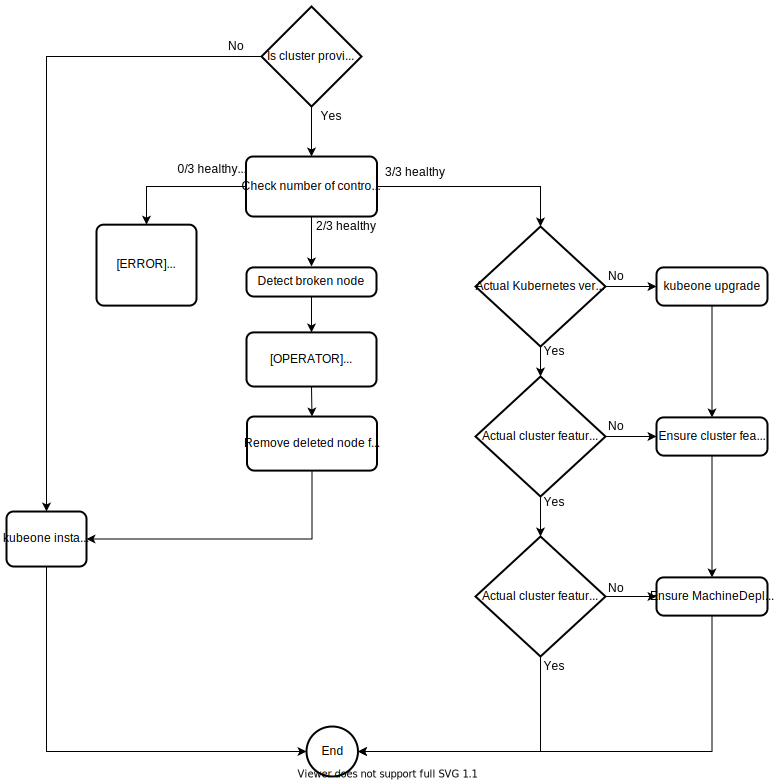

# KubeOne Reconciliation Process (`kubeone apply`) <!-- omit in toc -->

**Author:** Marko Mudrinić ([@xmudrii](https://github.com/xmudrii))
**Status:** Draft | Review | **Final**
**Created:** 2020-02-24
**Last updated:** 2020-07-13

## Table of Contents <!-- omit in toc -->

- [Abstract](#abstract)
- [Goals](#goals)
- [Non-goals](#non-goals)
- [Glossary](#glossary)
- [Implementation](#implementation)
  - [Probes](#probes)
  - [Reconciling The Cluster](#reconciling-the-cluster)
    - [The Cluster Is Not Provisioned](#the-cluster-is-not-provisioned)
    - [Etcd Is Broken / Etcd Quorum Is Not Satisfied](#etcd-is-broken--etcd-quorum-is-not-satisfied)
    - [Non-Healthy Nodes are Present, but Quorum Is Satisfied](#non-healthy-nodes-are-present-but-quorum-is-satisfied)
    - [All Nodes Are Healthy](#all-nodes-are-healthy)
    - [Static Worker Nodes](#static-worker-nodes)
    - [Dynamic Worker Nodes (MachineDeployments)](#dynamic-worker-nodes-machinedeployments)
- [Automated Leader Election](#automated-leader-election)
- [Deprecating Existing Subcommands](#deprecating-existing-subcommands)
- [Tasks & Efforts](#tasks--efforts)

## Abstract

KubeOne supports installing/provisioning, upgrading, and repairing clusters.
Currently, all features are implemented as dedicated subcommands, for example,
`install` and `upgrade`. Instead of having a subcommand for each feature,
we want to implement the reconciliation process under the `apply` subcommand.
`apply` would analyze the provided cluster configuration file (the expected
state) and the cluster actual state, and based on the difference take the
appropriate steps. The appropriate steps can be operations such as install,
upgrade, repair cluster, apply missing manifest, create, or rotate the worker
nodes.

## Goals

* Implement the `apply` subcommand
  * Implement probes to detect the actual state of the cluster
  * Implement the logic to take the appropriate steps depending on
  the results returned by probes (e.g. install or upgrade the cluster)

## Non-goals

* Implement the repair process
  * Implemented as part of the `kubeone install` command
  in [#888][automated-cluster-repairs]
* Fully automated disaster recovery in the case when the etcd quorum is lost
  * `kubeone apply` can be used along with the [disaster recovery document][disaster-recovery]
  to recover such clusters
* Deprecate existing subcommands (`install`, `upgrade`, and `status`)

## Glossary

* _etcd ring_: a group of etcd instances forming a single etcd cluster.
* _etcd member_: a known peer instance (running on the control-plane nodes) of
  etcd inside the etcd ring.
* _leader instance_: a VM instance, where cluster PKI gets generated, and the
  first control-plane components are launched at the cluster initialization
  time.

## Implementation

The reconciliation process is going to be invoked by the `kubeone apply`
command. The command takes the KubeOne cluster configuration manifest, which
represents the expected state, and optionally Terraform state and set of flags
and options.

Example: `kubeone apply --manifest config.yaml -t tfstate.json`

Once invoked, the command takes the following steps:
* parse the provided cluster configuration to determine the expected state
* run probes to determine the actual state of the cluster
* run a specific set of actions to turn the actual state into the expected
state (reconcile)

### Probes

Probes are used to determine the actual state of the cluster. They are
implemented as scripts to be executed over SSH or as Kubernetes API requests.
For example, a probe can check is `kubelet` running on a node or do all
required pods exist.

The following probes **must** be implemented:

* is the cluster provisioned
* is a specific node provisioned, ready, and responsive
* is the actual Kubernetes version matching the desired version
* is the Kubernetes API Server running and healthy
* is the etcd ring healthy and in the expected state (all control plane nodes
  joined)
* is the actual cluster configuration matching the expected cluster
  configuration
* are worker nodes running and responsive

Some of the mentioned checks are already implemented in some form in `upgrade`
and `status` subcommands.

### Reconciling The Cluster

Depending on the actual state of the cluster determined by probes, KubeOne will
try to modify the cluster to match the expected state.

Some actions will be taken automatically, however, it is not planned to
fully-automate all actions. For example, if `kubeone apply` determines that a
node needs to be repaired, it would be up to the operator to create a new VM,
update the cluster configuration (or Terraform state), and then run
`kubeone apply` again.

The following flowchart shows which actions are supported and how KubeOne makes
the decision based on the results returned by probes.

The first step in the reconciliation process is to determine is the cluster
provisioned and the number of healthy nodes.

This is done by running the following checks:

* are `docker` and `kubelet` packages installed
* are `systemd` services for `docker` and `kubelet` active and running
* is the `/etc/kubernetes/kubelet.conf` file present
* is `kubelet` reporting `ok` on the `/healthz` endpoint
* are the kube-apiserver and etcd pods running and being healthy
* is node part of the etcd ring

#### The Cluster Is Not Provisioned

This case is triggered when the `/etc/kubernetes/kubelet.conf` file is absent.
This usually happens when newly created VMs are provided or `kubeone reset` has
been run. In this case, `kubeone apply` would just invoke the installation
process (`kubeone install`).

It is important to make a difference between this case and the case when there
is no healthy node in the cluster (but the cluster has been provisioned), as
different steps should be taken.

#### Etcd Is Broken / Etcd Quorum Is Not Satisfied

If KubeOne determines that the [etcd quorum][etcd-quorum] is not satisfied
(e.g. 0 or 1 healthy node present), KubeOne will return an error. In such a
case, the etcd data integrity could **not** be guaranteed. It is required that
the operator take the following steps:

* run `kubeone reset` to unprovision the cluster
* run `kubeone apply` to reprovision the cluster
* restore the backup

An automated way for recovering from such a scenario is a non-goal for this
proposal.

#### Non-Healthy Nodes are Present, but Quorum Is Satisfied

If KubeOne determines that there are non-healthy nodes in the cluster, but
the [etcd quorum][etcd-quorum] is satisfied, KubeOne will attempt to
automatically repair the cluster.

A node is marked as non-healthy if:

* `docker` is not running or is failing
* `kubelet` is not running, is failing, or `/healthz` is reporting an error
* `kube-apiserver` is not running, is failing, or `/healthz` is reporting an
  error
* the appropriate etcd member is not healthy or not part of the etcd ring

In such cases, there is a high chance that rotating the node will fix the problem
and ensure that the cluster can continue working as expected.

The operator would have to manually remove the non-healthy instance
from the (cloud) provider and then update the KubeOne configuration manifest
(or Terraform state/output) to replace the old instance with a new one.

Running the `kubeone apply` command the next time would:

* remove the old Node object if needed
* remove the old etcd member from the ring
* invoke the provisioning process (`kubeone install`) to provision the new
  instance and join it a cluster

This process is explained in the [manual cluster repair][manual-cluster-repair]
document.

#### All Nodes Are Healthy

If all nodes are healthy, the reconciliation process compares the actual
cluster state and the expected state. That includes checks such as:
* Kubernetes versions match
* MachineDeployments defined in the expected state match MachineDeployments
  present in the cluster
* Static worker nodes defined in the expected state match actual static worker
  nodes

Depending on the case, the appropriate steps would be taken, such as upgrade the
cluster, create a new MachineDeployment, create a new static worker node.

#### Static Worker Nodes

The health checks and probes described above will be run on the static worker
nodes as well. If it's determined that the worker node is unhealthy, it is up
to the operator to replace the worker node instance and run `kubeone apply` to
provision the new instance, similar to the control plane repair process.

The reconciliation process will also take care of provisioning, upgrading, and
repairing the static worker nodes. Removing the static workers is done by
removing the underlying instance.

#### Dynamic Worker Nodes (MachineDeployments)

The reconciliation process will only take care of ensuring that all dynamic
worker nodes defined in the expected state exist in the cluster and run the
expected Kubernetes version.

Dynamic worker nodes will not be modified or removed by the reconciliation
process. Such operations should be done by the operator either by using
`kubectl` or Kubernetes API directly.

To make managing and changing dynamic workers (MachineDeployments) easier,
a dedicated subcommand (`kubeone config machinedeployments`) will be
implemented to allow exporting the manifest containing all MachineDeployments
objects defined in the KubeOne configuration manifest. Such manifest can be modified
and applied using `kubectl` (e.g. `kubectl apply -f`).

## Automated Leader Election

The leader is defined as a VM instance where cluster PKI gets generated and
the first control plane components are launched at the cluster initialization
time.

In the case of `install` and `upgrade` commands, the leader is chosen as:

* the first instance from the KubeOne cluster configuration
* manually chosen by the operator

The `kubeone apply` command implements the automated leader election process.
The leader is chosen as the first instance that has all required components
running, all required files present, and is part of the cluster.

**Note:** If a leader is manually chosen by the operator the choice will be
ignored by the `kubeone apply` command.

The `install` and `upgrade` commands will currently continue to use the old way
of choosing a leader.

## Deprecating Existing Subcommands

After consideration, it has been decided that the existing subcommands
(`install`, `upgrade`, and `status`) will not be deprecated. Instead,
they will remain functional and can be used if the operator wants to force
the specific operation.

## Tasks & Efforts

* Implement probes as described in the Probes section
* Implement the cluster reconciliation process
* Write E2E tests for the `kubeone apply` command
* Write and/or update documentation

[etcd-quorum]: https://etcd.io/docs/v3.5/faq/#why-an-odd-number-of-cluster-members
[manual-cluster-repair]: https://docs.kubermatic.com/kubeone/main/guides/manual-cluster-repair/
[automated-cluster-repairs]: https://github.com/kubermatic/kubeone/pull/888
[disaster-recovery]: https://docs.kubermatic.com/kubeone/main/guides/manual-cluster-recovery/
